# Olá! 👋

Sou formado em **Ciência da Computação** e atualmente estudo **Quality Assurance (QA)**, com foco em testes manuais, testes funcionais, análise de requisitos, elaboração de casos de teste e documentação de bugs.

Atualmente estou desenvolvendo projetos práticos para consolidar meus conhecimentos em:

- ✅ Testes Manuais e Funcionais
- ✅ Casos de Teste, Planos de Teste e Bug Reports
- ✅ Testes Exploratórios
- ✅ Técnicas de Teste (Particionamento de Equivalência e Análise de Valor Limite)
- ✅ SQL para validação de dados
- ✅ Testes de APIs com Postman
- ✅ Git/GitHub
- ✅ Metodologias Ágeis (Scrum)
- ✅ Automação de Testes (Cypress)

Também estudo boas práticas de qualidade de software e conceitos alinhados ao **ISTQB**, buscando evoluir continuamente como profissional de QA.

🎯 **Objetivo:** conquistar uma oportunidade como **QA Júnior**, contribuindo para a qualidade, confiabilidade e evolução dos produtos de software.

##

 
   
  
   
  

